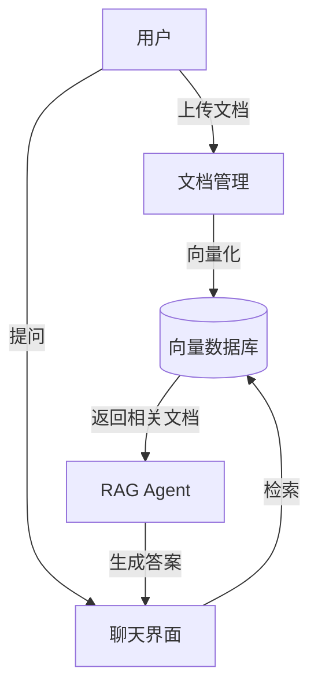

## 1. Product Overview
通用RAG Agent前端应用，提供知识库管理和智能问答功能。
- 解决企业/个人知识库检索与AI问答集成问题，面向开发者和企业用户
- 提供可配置的RAG系统，支持多种数据源和大语言模型

## 2. Core Features

### 2.1 User Roles
无需复杂角色系统，采用单一用户模式。

### 2.2 Feature Module
1. **聊天界面**: 与RAG Agent对话，查看引用来源
2. **文档管理**: 上传、管理知识库文档
3. **设置页面**: 配置API、模型参数和知识库设置

### 2.3 Page Details
| Page Name | Module Name | Feature description |
|-----------|-------------|---------------------|
| 聊天界面 | 消息输入 | 支持多轮对话、流式输出、Markdown渲染 |
| 聊天界面 | 来源展示 | 显示检索到的文档片段 |
| 文档管理 | 上传功能 | 拖拽上传PDF、TXT、Markdown等文件 |
| 文档管理 | 文档列表 | 查看、删除已上传文档 |
| 设置页面 | API配置 | 配置LLM API密钥和端点 |
| 设置页面 | 参数调优 | 调整温度、top_p、检索数量等参数 |

## 3. Core Process
用户上传文档 → 系统向量化存储 → 用户提问 → 检索相关文档 → 结合上下文生成答案

## 4. User Interface Design
### 4.1 Design Style
- 主色调：深蓝色 (#1e40af)，辅助色：青色 (#06b6d4)
- 按钮风格：圆角矩形，悬停有缩放效果
- 字体：Inter + JetBrains Mono (代码)
- 布局：双栏式，左侧聊天，右侧文档/设置
- 图标：Lucide图标库，简洁现代风格

### 4.2 Page Design Overview
| Page Name | Module Name | UI Elements |
|-----------|-------------|-------------|
| 聊天界面 | 消息区域 | 卡片式消息，有时间戳和来源标签 |
| 聊天界面 | 输入框 | 底部固定输入框，支持多行输入 |
| 文档管理 | 上传区 | 虚线边框拖拽区，文件类型图标 |
| 设置页面 | 表单 | 分组配置项，有说明文字 |

### 4.3 Responsiveness
桌面端优先，移动端适配为单栏布局

### 4.4 3D Scene Guidance
不涉及3D场景
